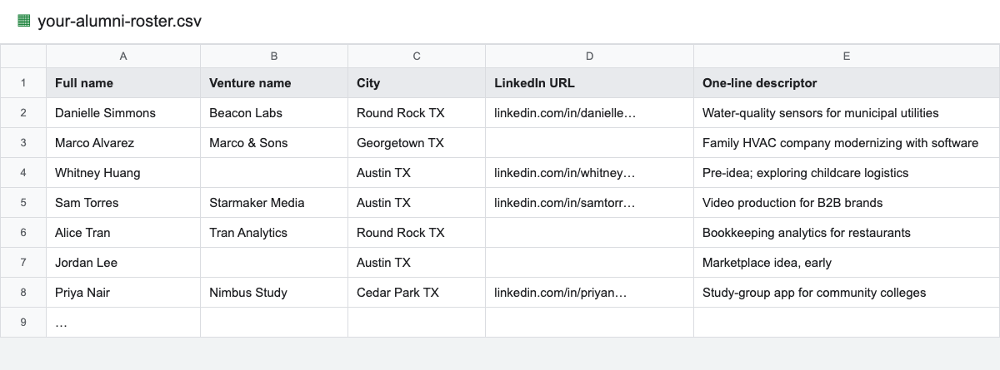
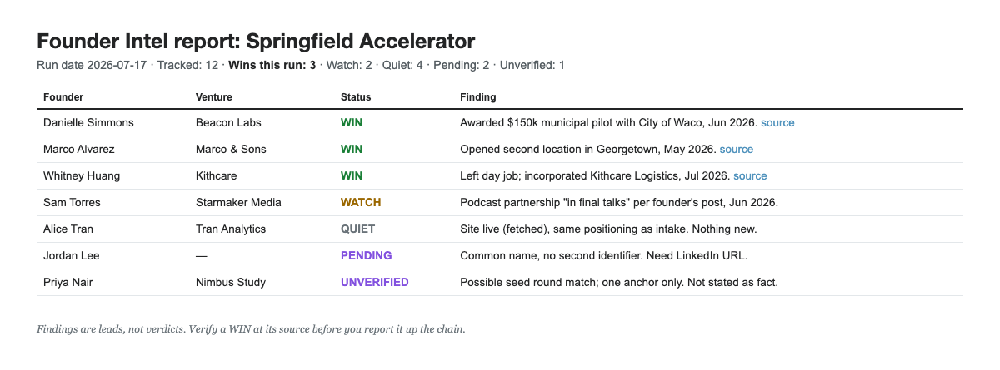

# Founder Intel

People who support founders for a living get measured on the success of their founders. Tracking that success is the hard part: Google Alerts don't work, and following everyone on LinkedIn isn't enough. Wins happen in other cities, on other platforms, years after your program ends.

Founder Intel is a tool that regularly captures your alumni's wins so you can report them up the chain. Send us your roster, and we scan the public record for what your founders went on to do: companies still alive, funding raised, acquisitions, press, wins you didn't know about. You get a report you can put in front of a funder or a board.

**1. You send your alumni roster**

**2. You get back a report you can hand a funder**

## Status: private pilot

We're running this with a small number of partner organizations, concierge-style. The code and scan methodology aren't published yet; we're still hardening them against our evaluation datasets.

Want your alumni scanned? [Request access](mailto:cam@joineleda.org?subject=Founder%20Intel%20access).

Prefer to run it yourself? The self-serve pack is live: [founder-intel-pack](https://github.com/joinELEDA/founder-intel-pack). Bring your own AI, your own roster, your own tokens. It's early and a little rough; its README says so honestly.

However you run it, treat findings as leads, not verdicts. If you've graduated 400 founders, you were never going to Google them all; Founder Intel points at the ones worth a closer look. Verify a win at its source before you report it up the chain.

---

Built by [ELEDA](https://joineleda.org), the Entrepreneur-Led Economic Development Association.
